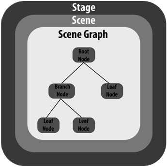
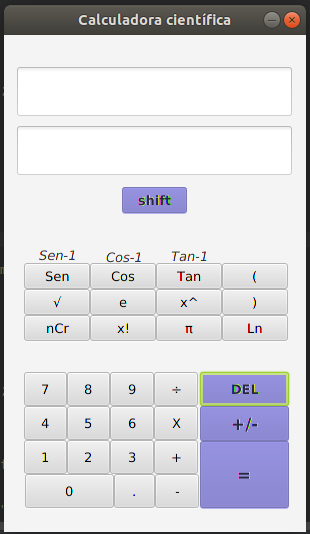

#JavaFX y JavaSwing 
**UNIVERSIDAD POLITÉCNICA DE VICTORIA**
**Programación Orientada A Objetos**

Por Armando Rodríguez y José Rafael Pérez

<br>14 de septiembre de 2019

---


##Introducción
En esta redacción estaremos hablando de las librerías para la creación de aplicaciónes con interfaces de usuario gráficas en el luenguaje Java las cuales son _JavaFX_ y _Java Swing_ para despúes hablar sobre las diferiencias que existen entre estas herramientas.
<br>

---
##JavaFX
Es cierto que **JavaFX** no es una tecnología completamente nueva pero ya está en su version 13 desde el 10 de septiembre de este año y según Oracle:
>JavaFX es un conjunto de paquetes de gráficos y medios que permite a los desarrolladores diseñar, crear, probar, depurar e implementar aplicaciones de cliente enriquecido que operan de forma consciente en diversas plataformas.

<br>


####¿Qué puedo crear con JavaFX?
Este framework permite crear una gran variedad de interfaces de usuario gráficas para apliacaciones Java, se espera sea el sucesor de la librería Swing para ser la librería GUI estándar de Java SE. Por lo general, son aplicaciones que cumplen con las redes que se despliegn en múltiples plataformas y muestran información en una interfaz de usuario moderna de alto rendimiento que incluye audio, vídeo, gráficos y animación. Con ello se pueden crear apliaciones complejas de una forma sencilla.

<br>
####Componentes
JavaFX trabaja con cuatro componentes principales, estos son: *Satage, Scene, Node* y *Layout*.

__*Stage*__ es el central elemento, actuando como un contenedor para todos los *Scenes*. Es el espacio donde todo sucende dentro.
__*Scene*__ es el elemento que contiene un grupo de *Nodes* (elemntos GUI).
__*Node*__ son los elementos que componen al *Scene* (botones, text-boxs, labels, etc.). Es posoble que estos tengan Nodes hijos jerárquicamente.
__*Layout*__ es el componenete responsable de definir como los *Nodes* los elementos son mostrados en pantalla. JavaFX prevee muchas variaciones del *Layout*, algunos de ellos son:
 - AnchorPane
 - GridPane
 - TilePane
 - BorderPane
 - FlowPane


#####La clase *Event*
Responsable de registrar y actuar a la entrada del usuario. Requiere un evento EventHandler para funcionar. Algunos nodos permiten al desarrollador registrar el controlador directamente a treavés del método *addEventHandler()* en otros casos existen métodos con un prefijo *setOn* para configurar los controladores. Algunos de ellos son:
- __*KeyEvent*__ registra la presión/liberación de un botón del teclado.
- __*Action*__ captura presión/liberación de un botón.
- __*MouseEvent*__ Captura eventos del mouse (arrastrar, borrr, clock, enter, salir, etc.).

#####Controles UI
Son usados para interactuar con los usuarios y mostrar información, algunos ejemplos son:
- Labels
- Button
- CheckBox
- RadioButton
- ListView
- TextField
- TextArea
- Accordion

<br>
####Sintaxis y estructura
Para utilizar JavaFX debemos de impoortar la clase __javafx.application.Application__ la cual proporciona los métodos del ciclo de vida de una aplicación JavaFX. 
- `public void init()`
- `public abstract void start(Stage primarySatage()`
- `public void stop()`

Para crear una aplicación JavaFX necesitamos:
1. importar *javafx.application.Application* como mínimo en nuestro código.
2. Heredar de la clase *Application* a nuestra clase.
3. Override al método `start()`de la clase *Application*.

En la estructura de una aplicación JavaFX, en el nivel más bajo de la jerarquía tenemos al componente __SceneGraph__, el cual puede pensarse como una colleción de *Nodes*.


*1.1 Estructura general de un aplicación JavaFX*
<br>

#####Creando un _Hello World_ en JavaFX
A partir de lo mencionado anteriormente generémos un _Hello World_ para de esta manera ejemplificar los puntos importantes de una apliación JavaFX. 

######Nuevo proyecto

Primeramente abramos nuestro IDE para crear un nuevo proyecto, o crea el archivo HelloWorld.java en caso de usar un editor de texto.
Como sabemos la librería JavaFX proporciona la clase `Application` de la cual nuestra aplicación debe heredar, en escencia nuestra nueva clase se debe ver de la siguiente forma:<br>

```Java

    import javafx.application.Application;

    public class HelloWorld extends Application{

    }
```


######Implementando el método _start()_

Como bien se mencionó todas las subclases de `javafx.application.Application` deben implementar el método abstracto `start()` de la clase `Application`. El método `start()` es llamado cuando la aplicación _javaFX_ inicia.

La siguiente imagen es un ejemplo de lo dicho pero con el método `star()` implementado:


```java
    import javafx.application.Application;
    import javafx.satge.Stage;

    public class HelloWorld extends Application{
        
        @Override
        public void start(Stage primaryStage){
            primaryStage.setTtitle("Hello World");
            primaryStage.show();
        }        
    }
```
    
El método `start` de la imagen recibe como parámetro de tipo Stage. El Stage es donde toda la parte visual de la aplicación JavaFX es mostrada.
El ejemplo anterior define un título al stage y después llama al método `show()`.

######¿Qué pasa con el método _main_? 
Actualmente puedes ejecutar una aplicación de JavaFX sin un método `main`, pero si deseas pasarle parámetros por linea de comandos lo necesitarás. Se aconseja usarlo para hacer el código más explícito y por consecuencia más legible. Así que agreguémoslo a nuestra clase `HelloWorld`.


```java
    import javafx.application.Application;
    import javafx.satge.Stage;

    public class HelloWorld extends Application{

        public static void main(String[] args){
            launch(args);
        }
        
        @Override
        public void start(Stage primaryStage){
            primaryStage.setTtitle("Hello World");
            primaryStage.show();
        }        
    }
```

En el código de arriba, el método `main` llama al método estático `launch()` con el parámetro recibido de la línea de comandos. El método `launch()` se localiza en la clase `Application` y es el encargado de ejecutar el JavaFX runtime junto con nuestra aplicación.


######Agregando el Scene al Stage
En los ejemplos previos solo tenemos una ventana sin ningún tipo de impresión dentro de ella. Para ello debemos de agregar el componente _Scene_ a el objeto _Stage_.

Todos lo componenetes que serán visualizados dentro de nuestra aplicación deben de estar en una _Scene_. 
Veamos el código de cómo agregar un _Scene_ al _Stage_ con una simple Label:

```java
    import javafx.application.Application;
    import javafx.satge.Stage;
    import javafx.scene.Scene;
    import javafx.scene.control.Label;

    public class HelloWorld extends Application{

        public static void main(String[] args){
            launch(args);
        }
        
        @Override
        public void start(Stage primaryStage){
            primaryStage.setTtitle("Mi Primera App JavaFX");

            Label label = new Label("Hello World, JavaFX");
            label.setAlignment(Pos.Center);
            Scene scene = new Scene(label, 400, 200);
            primaryStage.setScene(scene);

            primaryStage.show();
        }        
    }
```
Hasta este momento ya podríamos ejecutar nuestra aplicación y como resultado tendríamos un fantástico _Hello World!_.

#####El ciclo de vida de una aplicación JavaFX
El punto de entrada para una aplicacion de JavaFX es la clase `Applicaction`. JavaFX hace lo siguiente cuando la aplicación es ejecutada:
    1. Crea una instancia de la clase `Applicación`.
    2. Llama al método `init()` de la clase Applicación.
    3. Llama al método `start()`.
    4. En este punto la aplicación es visible y Java Runtime espera a que la aplicación finalice. La aplicación aborta cuando uno de los siguientes puntos ocurre:   
* La aplicación llama a Platform.exit()
* La última ventana es cerrada.  
5. Antes de salir, el método `stop()` de la clase `Àpplication` es invocado. Nosotros podemos sobreescribir éste método para limpiar o destruir cualquier fuente usada en nuestra aplicación.
<br>


---
##Java Swing 

Java Swing es una biblioteca de clases cuales sirven como herrmaientas para crear interfaces gráficas de usuario (GUI), incluye un amplio conjunto de widgets y paquetes que nos permite crear componentes GUI para aplicaciones Java. 

La biblioteca Swing fué codificada 100% en _Java_ con lo que podemos decir que es independiente de terceros, además, está construida sobre el conjunto de herramientas de widgets abstractos. Swing es parte del paquete stándar por lo que no es necesario importar ficheros adicionales a nuestros proyectos

Se podría decir que _Java Swing_ es la evolución del AWT(_Abstract Window Toolkit_) la cual igual es una librería enfocada a la construcción de interfaces.
<br>

####¿Qué puedo crear con Java Swing?
Al igual que JavaFX, Java Swing nos permité crear interfaces de usuario. Pero no olvidemos que Java Swing es el antecesor de JavaFX, por lo tanto, estamos en cierto modo, limitados en el desarrollo de nuestros proyectos. 


####Componentes
Toda aplicación en Java Swing debe tener un _top-level- container_ el cual contendrá toda la aplicación, estos pueden ser:

*__javax.swing.JFrame__* nos permite crar y gestionar gráficos, ventanas, botones, etc.
*__javax.swing.JApplet__* un applet puede ser usado para proporcionar funcionalidad a páginas de Internet que no puede ser satisfecha usando únicamente HTML.
*__JLabel__* textos e imágenes que podemos colocar en un Frame.
*__Diálogos__* ventanas de interacción sencila con el ususario, por ejemplo: 
   
   - `JOptionPane`: ventana de diálogo tipo _Sí/No/Cancelar/Aceptar_.
   - `JFileChooser`: ventna para elejir un archivo.
   - etc..

####Sintaxis y estructura

Una aplicación Swing se construye mezclando
componentes con las siguientes reglas: 
- Debe existir, al menos, un contenedor de alto nivle (_Top_Level Container_), que provee el soporte que las componentes Swing necesitan para el pintado y manejo de eventes.
- Otros componentes colgados del contenedor de alto nivel (estos pueden ser contenedores o componentes simples).


######Estructura básica con un _Hello World_
Veamos la estructura básica de una aplicación en Java Swing 
```java
import javax.swing.*;
import java.awt.*;
import java.awt.event.*;
public class HolaMundoSwing {
    public static void main(String[] args) {
	JFrame frame = new JFrame("HolaMundoSwing");
	final JLabel label = new JLabel("Hola Mundo");
	frame.getContentPane().add(label);
	frame.addWindowListener(new java.awt.event.WindowAdapter(){ 
            public void windowClosing(WindowEvent e){
                System.exit(0);
            } 	 
        }
        );
	frame.pack();
	frame.setVisible(true); 
    } 
}
```


En las primeras líneas de código vemos que se están importando los paquetes necesarios:
```java
import javax.swing.*;
import java.awt.*;
import java.awt.event.*;
```
Posteriormente se declara la clase HolaMundoSwing y en el método `main` se establece el _top-lavel container_ (contenedor de alto nivel principal). 
```java
public class HolaMundoSwing {
    public static void main(String[] args) {
        JFrame frame = new JFrame("HolaMundoSwing");
         ...
        frame.pack();
        frame.setVisible(true);
    }
}
```
Como podenmos notar en Java Swing no hace falta heredar a nuestra clase como lo vimos con JavaFX en la cual lo hacíamos con la clase `Application`.

---
##Diferiencias entre Java Swing y JavaFX
Una vez analizado las dos librerías para el desarrollo de interfaces de usuarios podemos de manera general realizar una breve comparación de estas dos herramientas

- __Componentes__. Java Swing tiene un numero de componenetes mayor a JavaFX.
- __Interface de usuario__. Los compoenentes estándar de diseño se pueden crear con Java Swing, en cambio en JavaFX se pueden crear diseños más ricos.
- __Desarrollo__. En JavaFX el desarrollo de UI es más rápido en comparación con Java Swing.
- __Funcionalidad__. En Java Swing no se esperan nuevas funciones. JavaFX tiene un grán número de herramientas que se espera que crezca en el futuro.
<br>


####Interfaz
En este caso es una aplicación con interfaz estática, es decir, la aplicación solo tiene una interfaz, no se manda llamar a más ventanas. Se trató de adicionar las operaciones más ejecutadas en una calculadora convencional teniendo como resultado la siguiente interfaz:

 


Como podemos observar en la imagen anterior, la culculadora posee dos _textfield_ uno para mostrar la entrada de dígitos y operadores (el primero), el otro para desplegar el resultado (el segundo).

Además vemos que se pueden ejecutar e ingresar las siguientes operaciones, constantes y signos:
* Suma
* Resta
* Multiplicación
* División
* Exponenciación
* Raíces cuadradas
* Operaciones Logarítmicas
* Operaciones trigonométricas
  * Seno y su inversa
  * Coseno y su inversa
  * Tangente y su inversa
* Uso de constantes
  * Euler
  * Pi
* Signos de agrupación
  * Paréntesis 
* Combinaciones 
* Factorial


---
######Limitaciones
Es necesario resaltar que para realizar las operaciones de exponenciación, combinaciones y factorial se debe realizar la operación sola, es decir, ingresar una de estas operaciones sin agregarle alguna otra operación.


###Conclusión  
Java Swing vs Java FX, ambos se utilizan mucho en el ecosistema de Java para construir componentes de la interfaz de usuario. Los desarrolladores deben conocer los conceptos de Java y pueden crear componentes de interfaz de usuario. Swing tiene una cantidad impresionante de componentes de interfaz de usuario disponibles, que tiene clases integradas para cada necesidad de interfaz de usuario, es decir, botón, panel, marco, etc. Java FX, por otro lado, tiene componentes de interfaz de usuario que se basan originalmente en Swing, ya que Swing llegó mucho anterior a JavaFX.


<br>
##Referencias
**Oracle** - JavaFX Overview  
[https://docs.oracle.com/javafx/2/overview/jfxpub-overview.pdf](http://)<br>

**Medium** - ¿Qué es JavaFX?
[https://medium.com/@osmandi/qu%C3%A9-es-javafx-41cfc327bdf2](http://)<br>

**Medium** - ¿Qué narices es eso de JavaFX?
[https://medium.com/@yonem9/java-qu%C3%A9-narices-es-eso-de-javafx-a09e7a7de7f1](http://)<br>

**EDUCBA** - Java Swing vs Java FX
[https://www.educba.com/java-swing-vs-java-fx/#targetText=Swing%20is%20the%20standard%20toolkit,lesser%20than%20what%20Swing%20provides.](http://)

